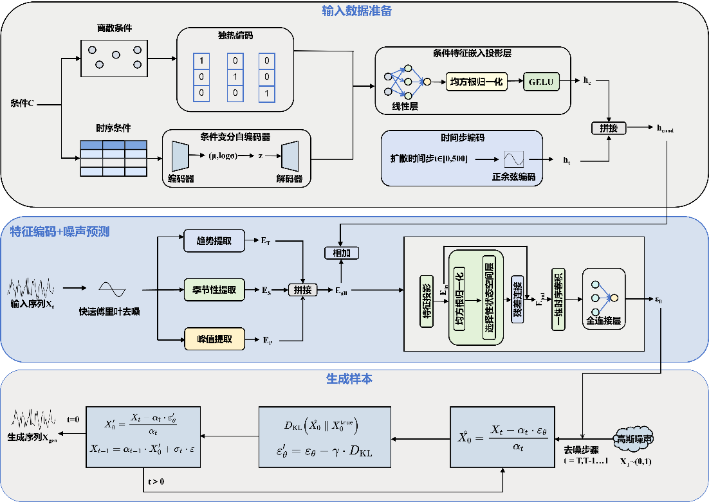

## CTD-Mamba-Diff: 基于时序感知和Mamba的条件扩散模型

本项目为论文配套源码，实现了CTD-Mamba-Diff模型：一种结合Mamba时序建模与条件扩散机制的工业时间序列生成模型。CTD-Mamba-Diff专为小样本生成任务设计，通过条件约束与高效时序特征提取，生成高质量合成时序数据，解决数据稀缺、GAN训练不稳定、复杂时序依赖建模困难等核心问题。


## 项目特性
支持主流工业/时序数据集：C-MAPSS (FD001/FD002/FD003/FD004)、ETTh1/ETTh2、北京/意大利空气质量、交通流量数据；基于M，amba架构优化长时序建模能力，结合条件扩散保证生成数据的可控性；内置数据质量评估（W距离、DTW、自相关性、可视化对比）；全流程自动化：训练→合成数据生成→效果评估
## 使用方法
1. 克隆本项目仓库
   ```bash
   git clone https://github.com/your-username/CTD-Mamba-Diff.git
   cd CTD-Mamba-Diff
2. 安装依赖环境 
    ```bash
    pip install -r requirements.txt
3. 训练并生成数据
    直接运行主程序，可修改代码内 data_name 切换数据集（FD001/FD002/ETTh1等）：
    ```bash
    python run.py
    ```

## 致谢
感谢以下开源项目对本工作的支持：
lucidrains/denoising-diffusion-pytorch扩散模型基础实现
官方Mamba开源代码库
相关时序预测与生成领域的开源工作
